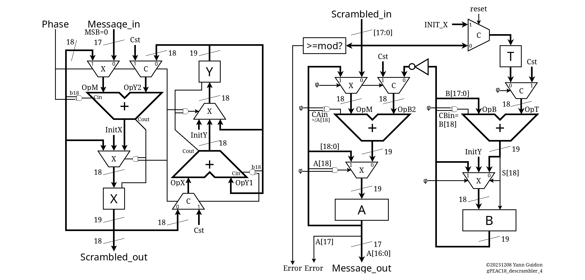
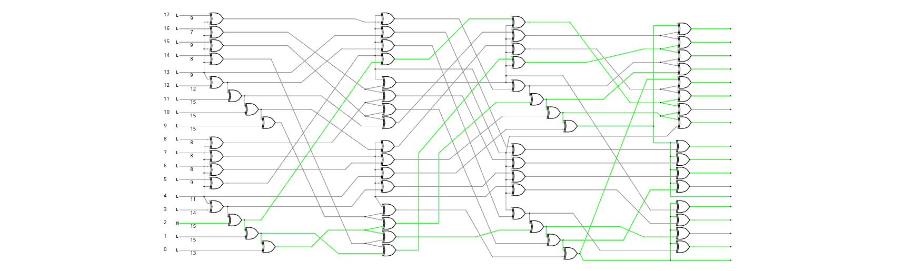
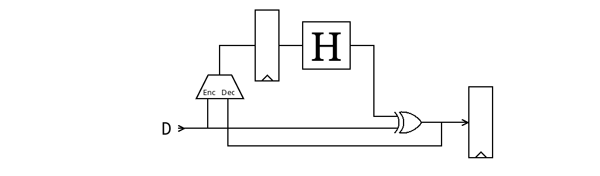

## What is this miniMAC

IMPORTANT: This custom circuit and protocol is not at all compliant or even compatible, even remotely linked to any 802.3 standard. It's all explained and detailed on Hackaday at https://hackaday.io/project/198914

This unit works on 16-bit data, which are scrambled with a 17th bit for data/control framing (C/D). The 18-bit result is suitable for sending to a (custom) PHY (see https://hackaday.io/project/203186 ) for serialisation and line coding. This unit combines two sophisticated circuits:

- The term "gPEAC" means "generalised Pisano with End-Around Carry", a class of PRNG/scrambler/checksum that uses different mathematics than Galois-based LFSR. The gPEAC18 unit is a modular additive-based scrambler-checksum that combines the 17 bits and creates an extra check bit.

- "Hammer" is a contraction of the "Hamming distance maximiser". The Hammer18 unit is a non-linear XOR-based scrambler that boosts the Hamming distance on the 18 bits. This version contains 3 layers of 18-bit permutations between 64 XOR2 gates, that looks like this: 

Together they provide strong scrambling, eliminate problems inherent with classical LFSRs, and detect errors very early. With an equivalent of 56 bits of state, the system is tailored for early retransmition. A external circuit is required to implement the higher-level protocol, buffering and retransmition logic.

## How it works

The Hammer circuit can work both as an encoder or a decoder, using one configuration pin.

The same can be done for the gPEAC circuit but it becomes overly complicated.

Due to pin constraints, the data are transmitted in DDR, using both edges of the clock signal.

The "Hammer" circuit takes 2×9 bits and generates 2×9 bits suitable for use by an associated PHY (to be designed later).

## How to test

Input a data word on the input, clock and enable, and get encoded or decoded data at the output.

## External hardware

Custom boards will be put together. I will try to get a pair of boards to connect together, such that I can verify a whole transmition chain

(to be continued)
